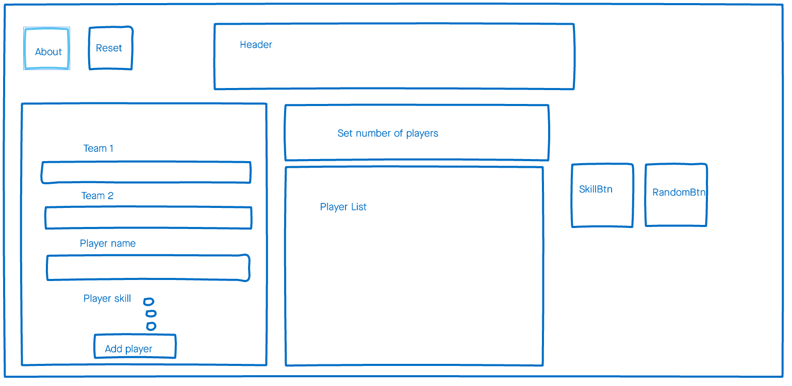
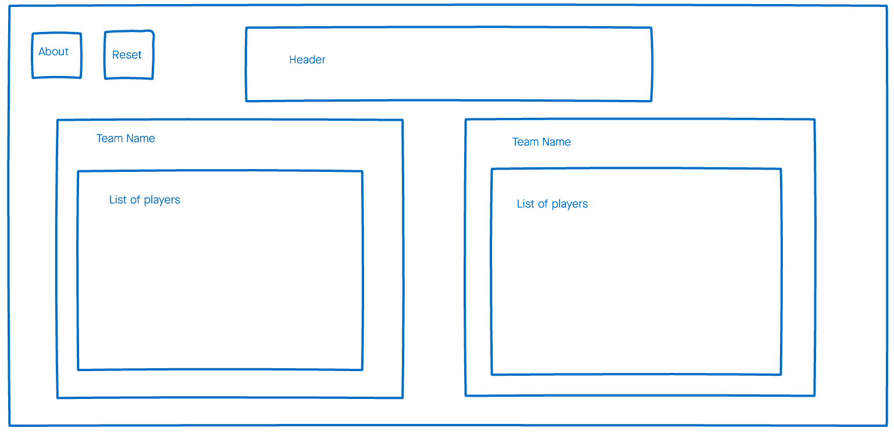
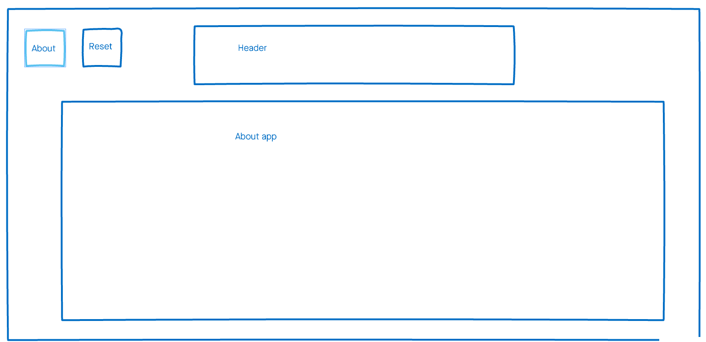

# Football fever

Technical challenge set by DevelopMe.

Can be viewed online [here](https://tomhall321.github.io/football-fever/).

## Setup

These instructions will get you a copy of the project up and running on your local machine for development and testing purposes.

### Requirements

You will need to have npm installed in order to set the application up.

### Installing

Clone the git repository and run npm install.

`git clone git@github.com:tomHall321/football-fever.git`

`npm install`

When all the packages are installed, run the app:

`npm start`

Open http://localhost:3000 to view it in the browser.

## Brief:
Create a tool which randomly picks 5-a-side football teams from a list of 10 names.

## Planning:
As per the brief, the MVP was to build an app that could take 10 names and randomly assign them to two separate teams of 5.
 
In addition to this I set out a list of features I wanted to achieve:

- Specify number of players.
- Sort the teams based on player skill level.
- Set team names.
- The team list should include player name and player skill.
- User should be able to delete a player incase of error.
- Ensure some degree of validation exists (blank player or team names should not be possible).
- An about page to help the user understand the purpose of the application.
- The app should persist for the user, and also have a reset function.
- Build a back end using Laravel to track teams and players.
- Unit tests for any complex functions.
- Some end-to-end tests to make sure new features don't break the app.

## Technical decisions:
- I decided to use React to build the components and Redux to handle state management.
- Conditional rendering instead of specifying routes with React-router.
- If time allows, deploy a backend built using Laravel.
- Git branch naming convention to focus my work (data/, logic/, components/, styling/).

## Testing:
- Redux dev tools to check that actions were happening and state was changing as expected.
- Thinking of edge cases (such as user attempting to add more players than specified in set players).
- Devtools to check whether app is responsive. 

## Styling:
- Bold colour scheme.
- App to be reminiscent of Teletext (find teletext style font).
- Information to be displayed on one screen.
- Needs to be responsive.
- Utilise SASS to enable nesting and for reusable variables.

I created simple wireframes for each page of the app: 

## Finished features & details of implementation:

### Specify number of players:
- User can choose from 2 to 22 players, the increment/decrement buttons are disabled when the player list contains the same number of players as that set in the number of players component.

### Teams sorted based on player skill level:
- Takes odd and even indexed players from an ordered array, perhaps not an optimal solution as team1 is always given the final (and therefore highest skilled player in the ordered array) and team2 receives the first (and therefore lowest skilled player). 

### Team/Player names & player skill:
- Used a class based component to update props (initilly defined in a constructor) based on an event (text input/ radio selection). The new state of the prop is then dispatched using mapDispatchToProps. 

### About page:
- Access to this page toogled on and off using conditional rendering (if the AboutPageBtn is clicked the state of the aboutPage prop changes).

### App persists / reset function:
- If the user has added players and team names, then access the about page, their changes will still be present on their return (use of redux-localstorage npm package). 
- To reset the app, the initial state is set.

## Lessons learnt:
- I should have created Unit tests while writing the relevant functions, I tested them using the command line but it would be better to have easily reusable tests.
- I would have planned the structure of my sass more carefully, I thought immediately styling css classnames would help, however this approach caused real problems when making sure the app was responsive.
- To avoid this in future I'd use BEM (the Block, Element, Modifier methodology) and think about universal styling from the offset.
- If I'd created a simple back-end at the beginning of the project there would have been more chance of it being integrated with the React front-end.

## Unfinished features:

- Laravel back end! As a result it's not possible to view previous team/player compositions. 
- Unit tests.
- End to end tests.